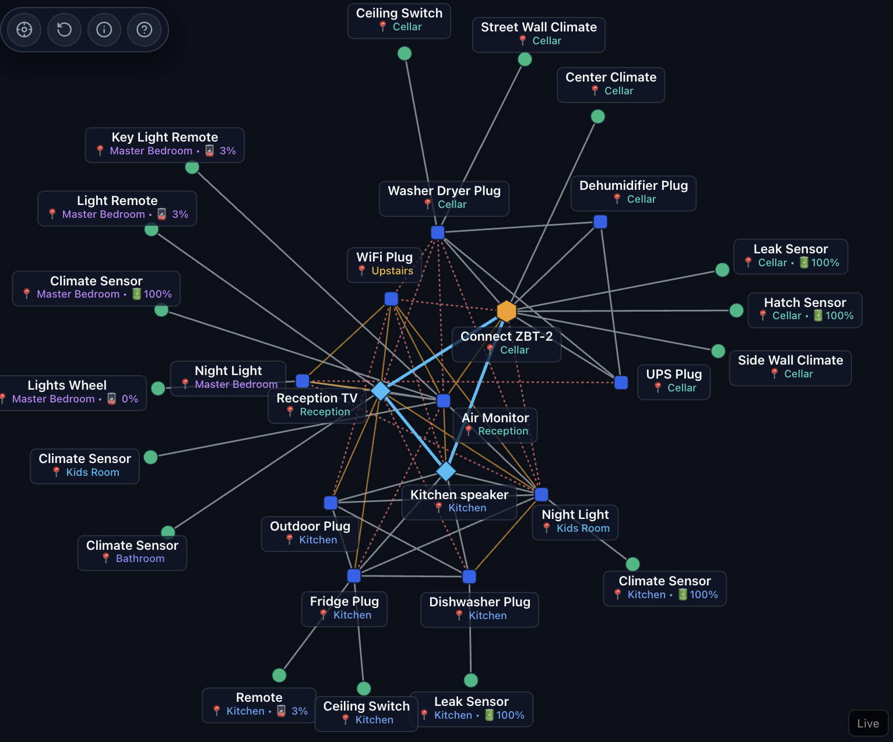

# Thread Mesh Topology Card for Home Assistant

[](https://github.com/hacs/default)
[](https://github.com/IvanAlekseev/thread-mesh-card/actions/workflows/validate.yml)
[](https://opensource.org/licenses/MIT)

An interactive, canvas-based **Thread Mesh Topology Visualizer** for Home Assistant Lovelace dashboards.



---

## Why This Exists

The built-in mesh graph inside the Matter Server web UI is technically great, but it lives deep inside add-on menus, lacks direct dashboard integration, and identifies devices primarily by raw node IDs rather than friendly device names and room assignments.

This entire card was built with **Google Antigravity**. While I work in software engineering, I haven't done much JavaScript in the past 15 years, so huge thanks to modern AI innovations for allowing me to dive in, experiment, and play with interactive frontend tooling.

I tried to be sensible about the coding approach and modular structure, but there are definitely issues and rough edges with it. It is shared here in the open as an early pet project for anyone in the Home Assistant community who finds it interesting or useful on their own setup!

---

## Features

- 🌐 **Real-Time D3 Force Simulation:** Canvas rendering with collision physics, outward repulsion, and continuous 360° trigonometric ray label projection.
- ⚡️ **Thread 1.4 & 1.3 Protocol Telemetry:** Dynamically detects Border Routers running Thread 1.4.0 (Connect ZBT-2, Google TV Streamer) and Matter 1.3 End Devices with live RF neighbor counts.
- 🔋 **Power Source & Sleepy End Device (SED) Detection:** Recognizes battery percentages and low-power sleep states for IKEA `TIMMERFLOTTE`, `BILRESA`, `KLIPPBOK`, and `MYGGBETT` hardware.
- 📶 **Interactive Link Hover & Signal Inspection:** Hover over any wire to view a real-time glass tooltip displaying signal strength (`dBm`), Link Quality (`LQI`), connection type, and endpoint devices.
- 🎨 **Authentic Signal-Preserving Highlights:** Hovering over links or nodes preserves their true signal colors (White for Strong, Amber for Medium, Red Dotted for Weak, Sky Blue for LAN Backbone) while dynamically elevating contrast and line thickness.
- 🗺️ **Hop-by-Hop Dijkstra Routing:** Click any device to trace its shortest mesh route back to the Preferred Leader Hub with animated particle flows.
- ⚓️ **Zero-Drift Isolated Dragging:** Dragging any individual device translates only that node without whole-map shifting or bouncing.
- 🎛️ **Unified SVG Glass Action Dock:** 4 sleek monochrome SVG controls for View Centering (🎯), Layout Reset (↺), Mesh Overview (ℹ️), and Guide & Legend (❓).
- 📊 **Dedicated Mesh Overview Modal (`i`):** Pure operational health monitor detailing live node counts, border router coordinator states, and room distributions.
- 💡 **Complete Guide & Legend Modal (`?`):** Visual reference for hardware shapes, wire signal quality levels, interaction shortcuts, and version info.
- 📱 **100% Relative Dynamic Viewport (Zero Pixels):** Fluid scaling with `100dvh` viewport clamping and safe-area insets (`env(safe-area-inset-bottom)`).
- 🛠️ **Two-Tier Inspector HUD:** Glanceable top status bar with an expandable 6-tile deep hardware & mesh diagnostic drawer.

---

## Installation

### Method 1: HACS (Recommended)
1. Open **HACS** in your Home Assistant sidebar.
2. Click **Frontend** $\rightarrow$ top-right **Three Dots** $\rightarrow$ **Custom Repositories**.
3. Add Repository URL: `https://github.com/IvanAlekseev/thread-mesh-card`
4. Select Category: **Dashboard** (or **Lovelace**).
5. Click **Download** and reload your browser.

### Method 2: Manual Installation (Zero-HACS)
1. Download `thread-mesh-card.js` from `dist/thread-mesh-card.js`.
2. Copy `thread-mesh-card.js` to your `<config>/www/` directory.
3. In Home Assistant, navigate to **Settings $\rightarrow$ Dashboards $\rightarrow$ Resources**.
4. Click **Add Resource**, enter URL: `/local/thread-mesh-card.js`, and select **JavaScript Module**.

---

## Dashboard Configuration

### Standard Panel View
```yaml
type: custom:thread-mesh-card
title: "Thread Mesh Topology"
```

### Full Viewport Grid Card
```yaml
type: custom:thread-mesh-card
```

---

## Local Development & Deployment

```bash
# Build standalone bundle locally (dist/thread-mesh-card.js)
python3 scripts/build.py

# 1-Command Build & Deploy directly to your Home Assistant instance
python3 scripts/deploy.py
```

---

## AI Agent Directives & Architecture Spec

- **AI Coding Directives:** See [`AGENTS.md`](AGENTS.md) for coding rules, zero-pixel mandates, and governance directives.
- **Engineering Specification:** See [`SPEC.md`](SPEC.md) for coordinate normalization mathematics, physics parameters, and WebSocket data pipeline architecture.

---

## License

This project is licensed under the [MIT License](LICENSE).
