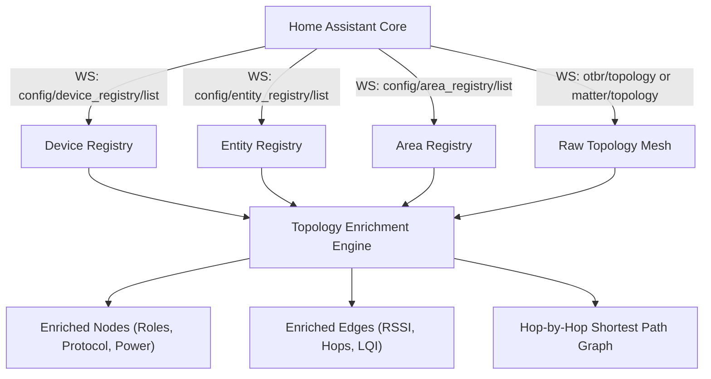

# Thread Mesh Topology Card: Technical & Architectural Specification

> [!NOTE]
> This specification documents the mathematical physics model, coordinate normalization system, WebSocket telemetry pipeline, responsive mobile layout, and UI hierarchy for `thread-mesh-card`.

---

## 1. Mathematical Physics & Collision Model

### A. Normalized Viewport Geometry
To guarantee identical layout proportions across mobile phones, tablets, and 4K displays with zero hardcoded pixels, all layout geometry is derived from the **normalized viewport radius**:

$$R = \frac{\min(\text{width}, \text{height})}{2}$$

```javascript
const width = holder.clientWidth || 800;
const height = holder.clientHeight || 600;
const R = Math.min(width, height) / 2;
```

### B. Pre-Computed 360° Ring Geometry (`seedInitialPositions`)
- **Center Coordinator (Leader):** Fixed at $(0, 0)$.
- **Mains Routers:** Arranged in an inner ring at $0.38 \times R$, clustered by room area sectors.
- **Battery Leaves:** Distributed in outward radial arcs at $0.58 \times R - 0.72 \times R$ relative to their parent router.
- **Simulation Settlement & Anchoring:** Uses `d3AlphaDecay(0.06)` and `d3VelocityDecay(0.6)`. Upon convergence (`onEngineStop`), all node positions are anchored (`n.fx = n.x; n.fy = n.y;`), ensuring manual dragging moves only the dragged device with zero whole-map drift.

### C. D3 Force Engine Parameters
All force strengths and clearances are normalized against $R$:

| Force Parameter | Value Function | Purpose |
| :--- | :--- | :--- |
| **Many-Body Repulsion (Charge)** | $F_c = -1.80 \times R$ (Leaves) / $-2.50 \times R$ (Leader) | Natural outward expansion |
| **Link Attraction Distance** | $d_{\text{link}} = 0.40 \times R$ (Thread) / $0.32 \times R$ (Backbone) | Balanced link spacing |
| **Collision Clearance** | $r_{\text{coll}} = 0.26 \times R$ (Leaves) / $0.36 \times R$ (Routers) | Boundary clearance |
| **Radial Hub Centering** | $k_r = 0.08$ | Gentle coordinator gravity |

### D. Continuous 360° Ray Label Projection
On every frame, labels calculate their position along the exact ray $\theta = \text{atan2}(v_y, v_x)$ from the parent node:

$$\text{boxExtent} = \begin{cases} \frac{H / 2}{|\sin\theta|} & \text{if } |\cos\theta| \cdot H < |\sin\theta| \cdot W \\ \frac{W / 2}{|\cos\theta|} & \text{otherwise} \end{cases}$$

$$\text{dist} = \text{size} + (3.5 / \text{scale}) + \text{boxExtent}$$
$$\text{boxX} = \text{node}.x + \text{dist} \cdot \cos\theta - \frac{W}{2}$$
$$\text{boxY} = \text{node}.y + \text{dist} \cdot \sin\theta - \frac{H}{2}$$

This guarantees an exact $3.5\text{px}$ visual margin in all 360° directions with zero coordinate staling during drag.

---

## 2. Telemetry & Protocol Data Pipeline



### A. Dynamic Protocol Detection
- **Thread Border Routers (Connect ZBT-2, Google TV Streamer):** Evaluates `tbrInfo.thread_version || '1.4.0'`. Renders `Thread 1.4.0 • 12 neighbors`.
- **Matter End Devices (TIMMERFLOTTE, BILRESA, Plugs):** Evaluates `mNode.thread_version || '1.3'`. Renders `Thread 1.3 • X neighbors`.

### B. Power Source & Sleepy End Device (SED) Classification
```javascript
const isBatteryDevice = (node.battery !== null && node.battery !== undefined) || 
                        node.shape === 'circle' || 
                        node.role === 'battery_leaf' || 
                        (node.roleLabel && node.roleLabel.toLowerCase().includes('battery')) ||
                        (node.roleLabel && node.roleLabel.toLowerCase().includes('sleepy'));
```
- Battery sensor with percentage $\rightarrow$ `🔋 100%` (or `🪫 15%`)
- Battery sensor without percentage $\rightarrow$ `🔋 Battery`
- Mains powered router/plug $\rightarrow$ `⚡️ Mains`

### C. Shortest Path Routing (Dijkstra)
Upon selecting any node, the engine computes the hop-by-hop route back to the Preferred Leader Hub using Dijkstra's algorithm:
- Connected route links illuminate in their authentic colors with increased thickness and particle flow.
- All non-participating nodes dim to 15% opacity (`rgba(255,255,255,0.15)`).

---

## 3. User Interface Hierarchy & Controls

### A. Floating Mini Glass Action Dock (Top Left)
Monochrome SVG icon controls with backdrop blur:
1. **Target / Crosshair (🎯):** Center and fit network in view (`zoomToFit`).
2. **RotateCcw (↺):** Reset custom drag positions to dynamic 360° defaults.
3. **Info (ℹ️):** Dedicated Mesh Overview & Telemetry modal.
4. **HelpCircle (❓):** Hardware shapes, signal quality lines, interaction guide, and version credits.

### B. Interactive Link Tooltips & Signal Inspection
- Hovering over wires displays a glass tooltip with live connection type (`📶 Strong Link` / `⚡ Backbone`), endpoint device names and room assignments, RSSI (`-77 dBm`), and LQI (`3/3`).
- Uses `linkHoverPrecision(8)` for smooth line detection.
- Elevates hovered wire thickness to `3.4px` at full opacity while strictly preserving its authentic signal color.

### C. Bottom Action Bar & 6-Tile Diagnostic Drawer
- **Quick Main Row:** Node icon, short name, area pill, power status, route hop count, HA device link gear, drawer expander.
- **6-Tile Deep Drawer:** Thread Role, Mesh Relay Path (with LQI & intermediate hops), Hardware Model & Hex ID, Manufacturer, Extended Address (EUI-64), Protocol & Density.
